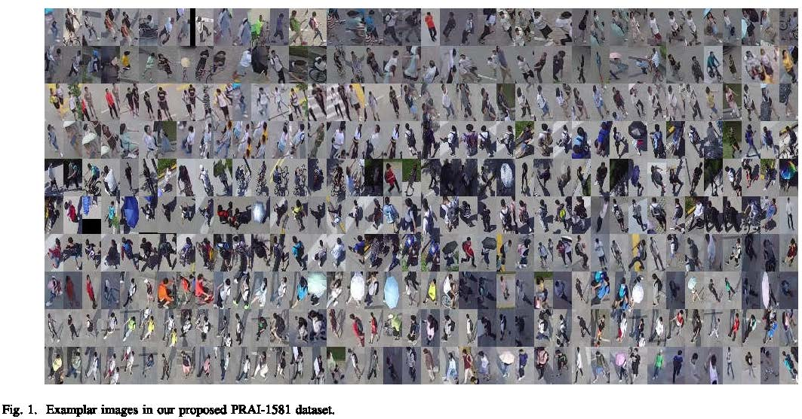

# PRAI-1581
In this page, we introduce Person ReID in Aerial Imagery (PRAI-1581) dataset.

Our paper "Person Re-identification in Aerial imagery" (https://arxiv.org/abs/1908.05024) has been accepted by IEEE Transactions on Multimedia.
## Citation
If you use this dataset in your research, please kindly cite our work as,    
```
  @article{zhang2020person,
    title={Person Re-identification in Aerial Imagery},
    author={Zhang, Shizhou and Zhang, Qi and Yang, Yifei and Wei, Xing and Wang, Peng and Jiao, Bingliang and Zhang, Yanning},
    journal={IEEE Transactions on Multimedia.},
    year={2020}
  }
```
## PRAI-1581 dataset


The dataset package can be downloaded from the following links:
```
Baidu Disk
Link：https://pan.baidu.com/s/1fVv39Vg1-yv7FdPIm55e7g 
Fetch code：ty1r
```

```
Google Drive
Link: https://drive.google.com/file/d/1xD8nejKwQQg8AlTKzs77p0IkVqZ8y_wF/view?usp=sharing
```
